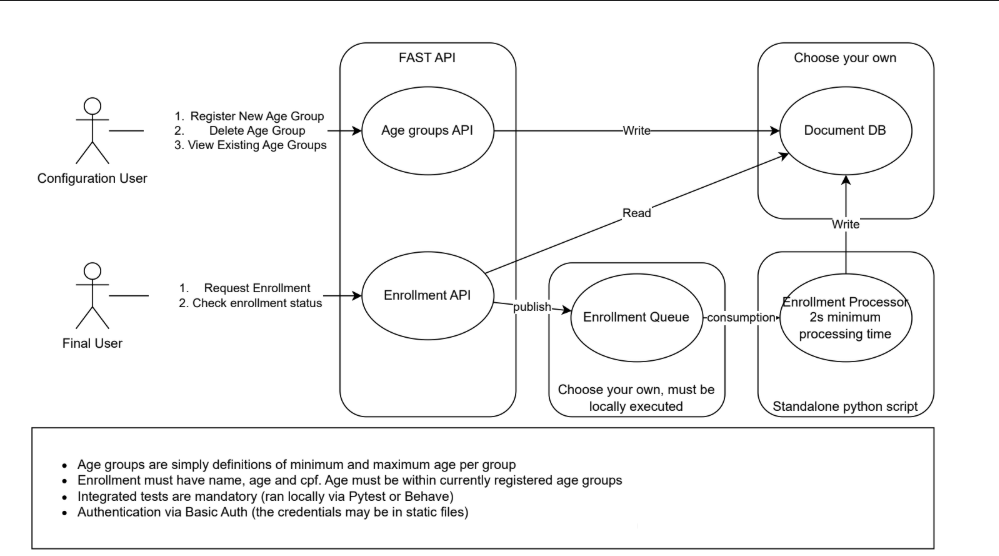

# Serverless Enrollment System POC

This project is a minimalist Proof of Concept for a serverless enrollment system, built on AWS using the Serverless Application Model (SAM).

## Architecture



The system uses API Gateway for REST endpoints, Lambda for compute, SQS for asynchronous processing, and DynamoDB for data storage.

## Prerequisites

*   AWS CLI
*   AWS SAM CLI
*   Python 3.9+
*   Docker (for local testing with `sam local invoke`)

## Project Structure

```
.
├── src
│   ├── age_groups         # Lambda code for age group functions
│   │   └── app.py
│   ├── enrollments        # Lambda code for enrollment request function
│   │   └── app.py
│   └── processor          # Lambda code for the enrollment processor
│       └── app.py
├── tests
│   ├── test_age_groups.py
│   ├── test_enrollments.py
│   └── test_processor.py
├── template.yaml          # AWS SAM template
├── requirements.txt       # Python dependencies
└── README.md
```

## Deployment

1.  **Build the application:** This command compiles your code and prepares it for deployment.
    ```bash
    sam build
    ```

2.  **Deploy to AWS:** The guided deploy will prompt you for parameters like a stack name and AWS region.
    ```bash
    sam deploy --guided
    ```
    Take note of the API Gateway endpoint URL and the API Key from the command's output.

## Running Tests
1.  **Install dependencies:**
    ```bash
    pip install -r requirements.txt
    ```
2.  **Run the tests:**
    ```bash
    pytest
    ```

## API Usage

Replace `YOUR_API_ENDPOINT_URL` and `YOUR_API_KEY` with the values from the deployment output.

**1. Create an Age Group**
```bash
curl -X POST \
  https://{YOUR_API_ENDPOINT_URL}/age-groups \
  -H "Content-Type: application/json" \
  -H "x-api-key: {YOUR_API_KEY}" \
  -d '{"min_age": 18, "max_age": 25}'
```

**2. View All Age Groups**
```bash
curl https://{YOUR_API_ENDPOINT_URL}/age-groups \
  -H "x-api-key: {YOUR_API_KEY}"
```

**3. Delete an Age Group**
```bash
curl -X DELETE https://{YOUR_API_ENDPOINT_URL}/age-groups/{age_group_id} \
  -H "x-api-key: {YOUR_API_KEY}"
```

**4. Request an Enrollment**
```bash
curl -X POST \
  https://{YOUR_API_ENDPOINT_URL}/enrollments \
  -H "Content-Type: application/json" \
  -H "x-api-key: {YOUR_API_KEY}" \
  -d '{"name": "John Doe", "age": 22, "cpf": "12345678900"}'
```
*(Save the returned `enrollment_id`)*

**5. Check Enrollment Status**
Wait a few seconds for the processor to run, then check the status.
```bash
curl https://{YOUR_API_ENDPOINT_URL}/enrollments/{enrollment_id} \
  -H "x-api-key: {YOUR_API_KEY}"
```

## Cleanup

To delete the application and all associated AWS resources, run the following command, replacing `<stack-name>` with the name you provided during deployment.

```bash
aws cloudformation delete-stack --stack-name <stack-name>
```
